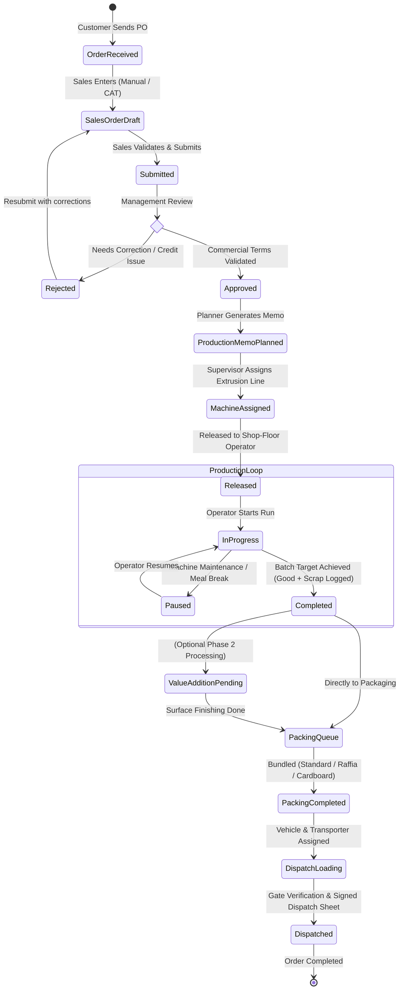

# Business Process Flow & State Machine Specifications
## Project: FixoBoard Manufacturing Management System (MMS)
**Document Version:** 1.0.0  
**Target Organization:** FixoBoard  

---

### 1. Main Business Workflow Diagram

---

### 2. Detailed Domain State Machines

#### 2.1 Sales Order State Machine
| Current State | Allowed Next States | Trigger / Condition | Permitted Role |
| :--- | :--- | :--- | :--- |
| `DRAFT` | `SUBMITTED`, `CANCELLED` | Order lines populated and saved | SALES, ADMIN |
| `SUBMITTED` | `APPROVED`, `REJECTED`, `CANCELLED` | Management commercial review | MAIN_HEAD, ADMIN |
| `REJECTED` | `DRAFT`, `CANCELLED` | Sales modifies lines/terms | SALES, ADMIN |
| `APPROVED` | `PARTIALLY_PRODUCTION`, `IN_PRODUCTION`, `CANCELLED` | Production Memos created | PRODUCTION, ADMIN |
| `PARTIALLY_PRODUCTION`| `IN_PRODUCTION`, `PARTIALLY_DISPATCHED` | Partial runs and dispatches | SYSTEM, DISPATCH |
| `IN_PRODUCTION` | `PARTIALLY_DISPATCHED`, `COMPLETED` | Production finished, goods packed | SYSTEM, DISPATCH |
| `PARTIALLY_DISPATCHED`| `COMPLETED` | Final shipment gate out | DISPATCH, ADMIN |
| `COMPLETED` | None | Terminal state | N/A |
| `CANCELLED` | None | Terminal state | MAIN_HEAD, ADMIN |

#### 2.2 Production Memo State Machine
| Current State | Allowed Next States | Trigger / Condition | Permitted Role |
| :--- | :--- | :--- | :--- |
| `DRAFT` | `APPROVED`, `CANCELLED` | Planner sets batch quantities | PRODUCTION, ADMIN |
| `APPROVED` | `PLANNED`, `MACHINE_ASSIGNED`, `CANCELLED` | Schedule locked | PRODUCTION, ADMIN |
| `PLANNED` | `MACHINE_ASSIGNED`, `CANCELLED` | Extruder line allocated | PRODUCTION, ADMIN |
| `MACHINE_ASSIGNED` | `RELEASED`, `CANCELLED` | Operator queue unlocked | PRODUCTION, ADMIN |
| `RELEASED` | `IN_PROGRESS`, `PAUSED`, `CANCELLED` | Operator clocks in job | PRODUCTION, OPERATOR |
| `IN_PROGRESS` | `PAUSED`, `COMPLETED` | Run running or paused | OPERATOR, PRODUCTION |
| `PAUSED` | `IN_PROGRESS`, `COMPLETED` | Operator resumes line | OPERATOR, PRODUCTION |
| `COMPLETED` | None | Total good output achieved | SYSTEM, PRODUCTION |
| `CANCELLED` | None | Terminal state | PRODUCTION, ADMIN |

#### 2.3 Dispatch State Machine
| Current State | Allowed Next States | Trigger / Condition | Permitted Role |
| :--- | :--- | :--- | :--- |
| `DRAFT` | `READY`, `CANCELLED` | Vehicle & driver assigned | DISPATCH, ADMIN |
| `READY` | `LOADING`, `CANCELLED` | Loading dock opened | DISPATCH |
| `LOADING` | `DISPATCHED`, `CANCELLED` | Packages loaded & verified | DISPATCH |
| `DISPATCHED` | None | Gate out confirmed, Sheet signed | DISPATCH, ADMIN |
| `CANCELLED` | None | Dispatch aborted | DISPATCH, ADMIN |

---

### 3. Exception & Rework Sub-Flows

1. **Scrap / Rejection Overflow:** If an extrusion run logs rejected sheets exceeding 10% of planned batch, the system triggers an alert on the Production Supervisor dashboard requiring a rejection reason code (e.g. `DIE_LINES`, `DENSITY_VARIANCE`, `THICKNESS_UNEVEN`, `CONTAMINATION`).
2. **Partial Dispatch Handling:** When only a subset of items or quantities is packed, the system allows creating a partial dispatch. The Sales Order automatically shifts to `PARTIALLY_DISPATCHED`, keeping the remaining balance open in the production/dispatch pipeline until 100% fulfillment.
